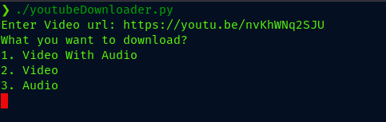
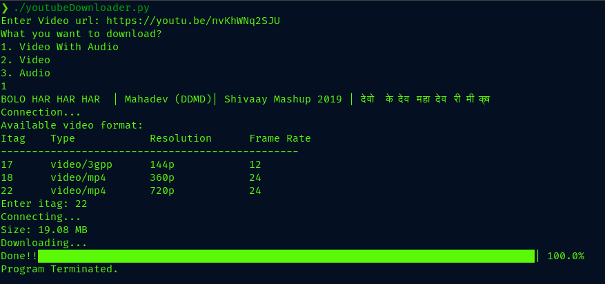
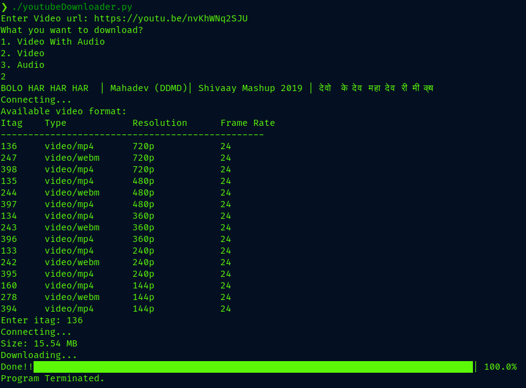
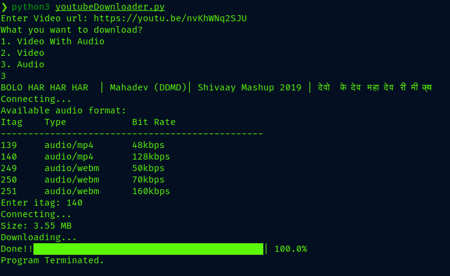

# YouTube Video, Audio Downloader
> This program is compile in Linux os, to make working in windows there need to change the download path in windows file format. 

> `videos/ to video\` and `audios/ to audios\`

* videos and audios dir will automatically created in main program directory and the videos will be download in videos and audios in audios dir.

* To use provided virtual environment
> In Linux `source virtual_env/bin/activate`

* Run program simply by:
> `./youtubeDownloader.py` OR
> `python3 youtubeDownloader.py`

* First give the valid url, then choose video with audio, video or audio what you wants to download. Follow the given instructions. Finally enter the corresponding itag number to download required file.

1. Run program
   
    

    OR

    

2. To download video and audio in same file
   
   > Option 1
    

3. To download video only
   
   > Option 2
    

4. To download audio only
   
   > Option 3
    

### That's all for now.